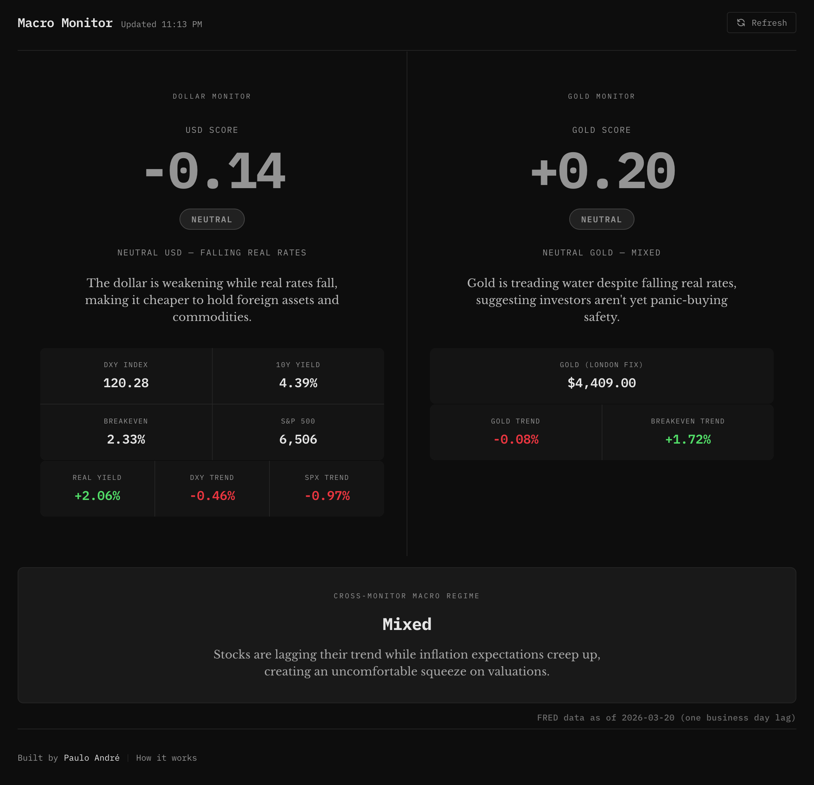

# Macro Monitor

A single-page dashboard that answers three questions in five seconds:
1. **Is the dollar strong or weak, and why?**
2. **Is gold confirming or diverging?**
3. **What does the combination tell me about the macro environment?**

Built for macro-aware individuals — investors, analysts, founders — who want signal without noise. Two scores, two regime labels, one cross-monitor macro read. Open it, read it, close it.



## How it works

The worker fetches five data series (four from FRED, gold from Yahoo Finance), computes derived values, scores both the dollar and gold, classifies individual and cross-monitor regimes, and calls Claude to generate plain-English interpretations. The frontend displays the result.

```
FRED + Yahoo Finance → Cloudflare Worker → USD Score + Gold Score + Macro Regime → Static Frontend
```

### Dollar Monitor

**USD Score** — weighted composite of four normalized signals:

| Weight | Signal | What it captures |
|--------|--------|-----------------|
| 40% | DXY trend (MA20 vs MA100) | Is the dollar gaining momentum? |
| 30% | Real yield trend | Are dollar assets attractive after inflation? |
| 20% | Inverted gold trend | Is money leaving hard assets? |
| 10% | Inverted S&P 500 trend | Is money leaving risk assets? |

### Gold Monitor

**Gold Score** — weighted composite:

| Weight | Signal | What it captures |
|--------|--------|-----------------|
| 40% | Gold trend (blended momentum + trend) | Where is gold headed? Blends MA5/MA20 momentum (60%) with MA20/MA100 trend (40%) to catch sharp reversals. |
| 30% | Inverted real yield trend | Falling real yields = gold tailwind |
| 20% | Breakeven trend | Rising inflation expectations = gold tailwind |
| 10% | Inverted DXY trend | Weak dollar = gold tailwind |

### Cross-Monitor Macro Regime

The relationship between the two monitors reveals the macro environment:

| USD | Gold | Macro Regime | What it means |
|-----|------|-------------|---------------|
| Strong | Weak | Rates Rising | Classic tightening — rates up, dollar up, gold suppressed |
| Weak | Strong | Reflation / Stagflation | Dollar weakening as gold confirms inflation or stress |
| Strong | Strong | Stress Safe Haven | Both acting as safe havens — fear signal |
| Weak | Weak | Disinflationary Risk-On | Risk assets leading — neither dollar nor gold bid |
| Neutral | Strong | Gold-Specific Driver | Geopolitical or central bank buying |
| Strong | Neutral | USD Technical Move | Dollar strength without gold confirmation |

### Signal thresholds

Score > +0.20 = **STRONG**. Score < -0.20 = **WEAK**. In between = **NEUTRAL**.

### Interpretations

Three plain-English sentences generated by Claude (Haiku) — one for dollar, one for gold, one for the combined macro read. No jargon, no Bloomberg-speak.

## Stack

| Layer | Choice |
|-------|--------|
| Frontend | HTML + vanilla JS + Tailwind CDN |
| Backend | Cloudflare Worker |
| Data | FRED API (rates, DXY, S&P) + Yahoo Finance (gold) |
| Interpretation | Claude API (Haiku) |
| Deploy | Cloudflare Pages + Workers |

No framework. No build step. One `index.html`, one `app.js`, one worker.

## Setup

### 1. Deploy the worker

```bash
cd worker
npm install

# Set your API keys as secrets
wrangler secret put FRED_API_KEY
wrangler secret put ANTHROPIC_API_KEY

# Deploy
npm run deploy
```

### 2. Configure the frontend

Update `API_URL` in `frontend/app.js` to point to your deployed worker URL.

### 3. Serve the frontend

Any static host works — Cloudflare Pages, Netlify, Vercel, or just open `index.html` locally.

```bash
cd frontend
npx serve .
```

### Secrets required

| Secret | Source | Cost |
|--------|--------|------|
| `FRED_API_KEY` | [fred.stlouisfed.org](https://fred.stlouisfed.org/docs/api/api_key.html) | Free |
| `ANTHROPIC_API_KEY` | [console.anthropic.com](https://console.anthropic.com/) | ~$0.001/request |

## Data sources

| Source | Series | Description |
|--------|--------|------------|
| FRED | DTWEXBGS | Trade-Weighted U.S. Dollar Index |
| FRED | DGS10 | 10-Year Treasury Constant Maturity Rate |
| FRED | T10YIE | 10-Year Breakeven Inflation Rate |
| FRED | SP500 | S&P 500 Index |
| Yahoo Finance | GC=F | Gold Futures (daily close) |

FRED data updates daily with a one-business-day lag. Yahoo Finance gold data is near real-time.

## What this is not

- Not a trading terminal
- Not financial advice
- Not real-time (FRED data is delayed one business day; gold is near real-time)

## License

MIT
